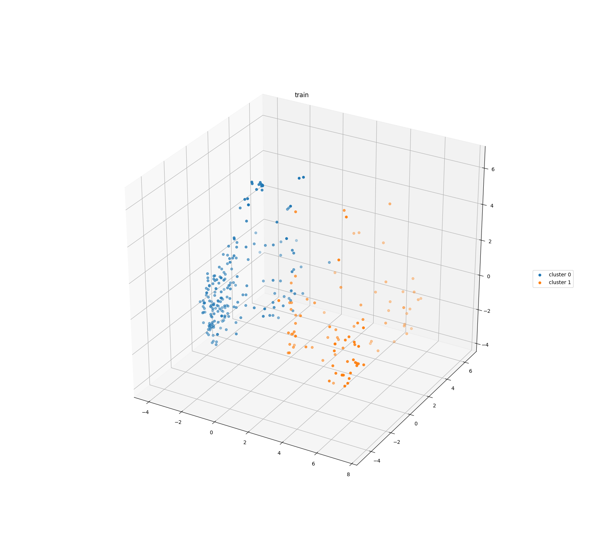
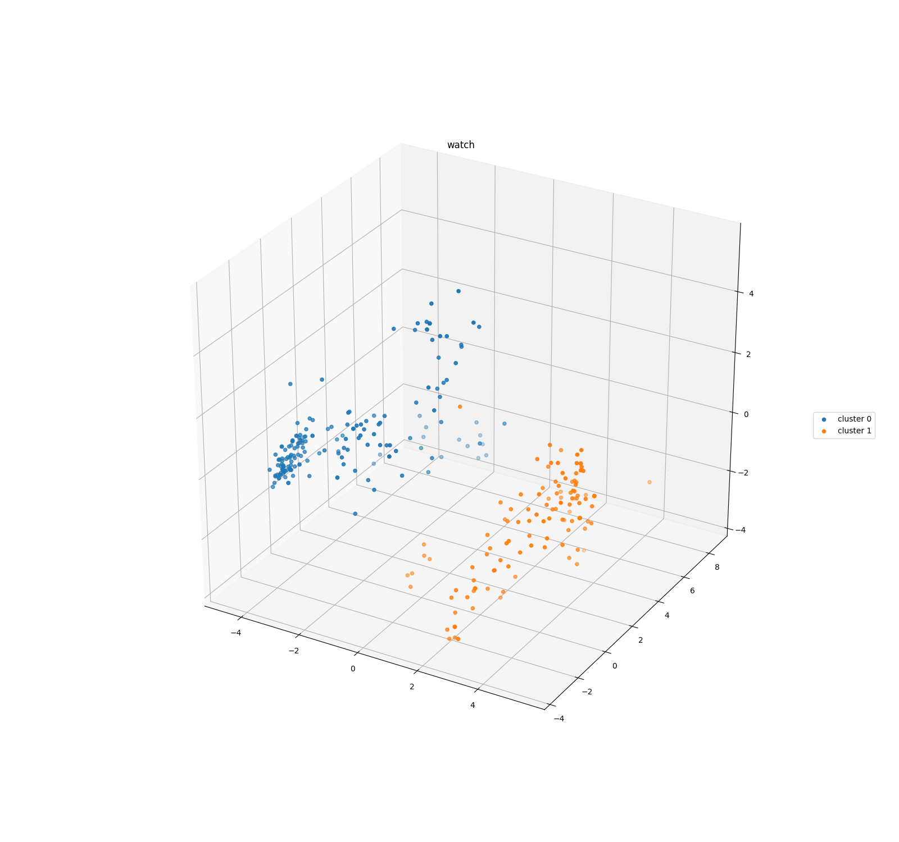
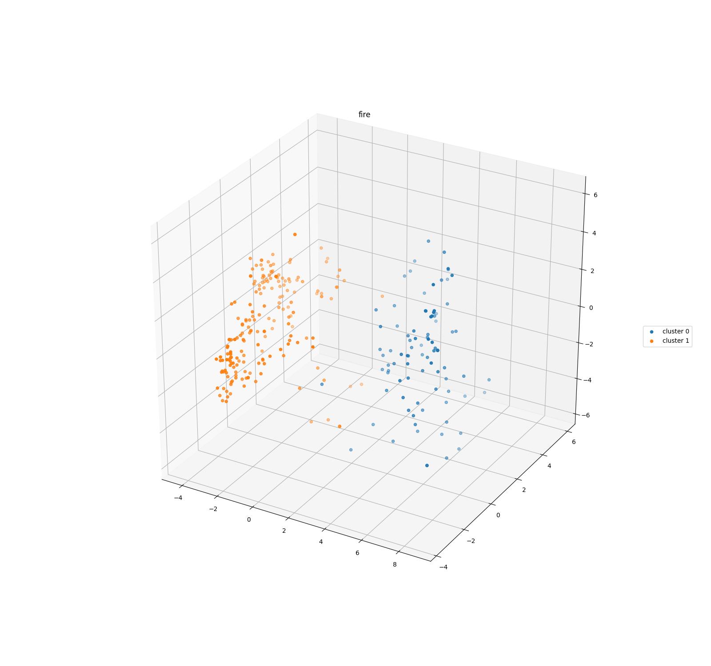
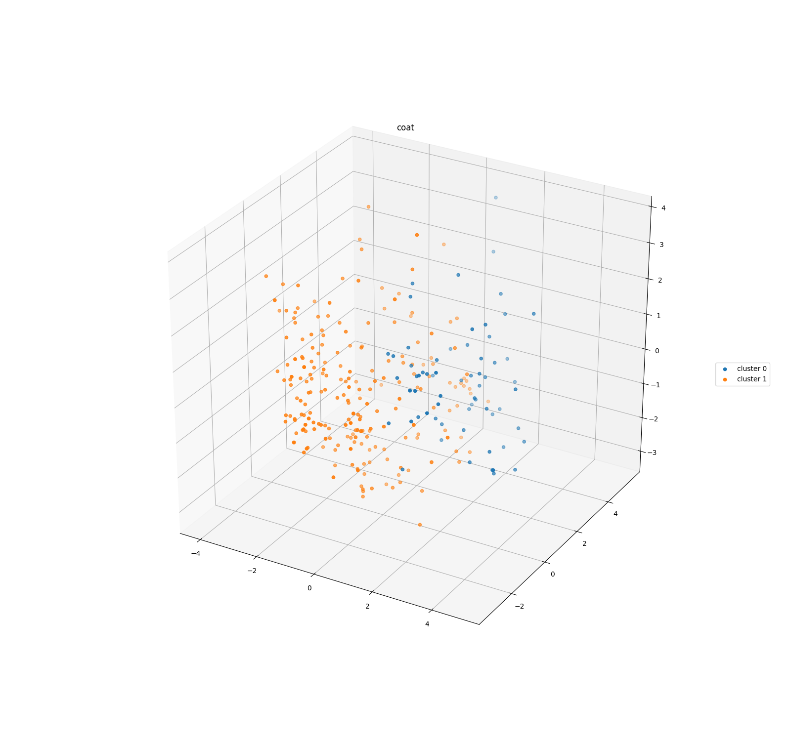

# Contextual Embeddings Study

Please see [Examples](#Examples) below. 

## Requirements
    1. TensorFlow 1.12
    2. TensorFlow Hub
    3. tqdm
    4. sklearn
    5. nltk
    6. matplotlib

## Usage

### Use preprocessed results

Download the [required pickle file here](https://drive.google.com/open?id=149RvKn4nPldCCmVd8Yvo7IcDhbCC4ekX), then put it under the project root directory.

**Interactive**

To see a specific word in interactive mode:
   
    python visualize.py --word fire --n 2
    
 The above command visualize the embedding clusters of **fire**, with a cluster number of 2.

**Get plots for all**
    
    python visualize.py
    
### Create from scratch

    1. download SNLI, then unzip under project root.
    2. move preprocess.py under the SNLI sub directory.
    3. python preprocess.py (this will create text.txt under the SNLI sub directory).
    4. python extract_and_compare.py (this will create snli.pkl and word2embed.pkl).

Then refer to **Use preprocess results**
    
## Methodology

Use the training set of [SNLI](https://nlp.stanford.edu/projects/snli/), 
        
    1. pick the most frequent 200 - 400 words 
       (The top 200 words have many punctuations and pronouns, and are thus not interesting to study).
    2. extract the ELMo embeddings.
    3. for each word, use kmeans to cluster its ELMo representations.
    4. Visualize by transform the 1024 dimensional ELMo embeddings to 3 dimensional.

## Result

See *images* for visualized clusters for each word.

## Problems

To visualize the clusters, we reduce the embedding size from 1024 to 3 by PCA, which could
make it hard to distinguish some clusters from others. 
    
## Examples

### Words with multiple meanings

The words below could either be a verb or a noun. 
We can see 2 obvious clusters for the embeddings of these words.

**train** with 2 clusters

**watch** with 2 clusters

**fire** with 2 clusters

### Words with one meaning

For some words which typically have one meaning, we do not observe obvious clusters.

**coat** 

**train** with 2 clusters  |  **watch** with 2 clusters
:-------------------------:|:-------------------------:
  |  

